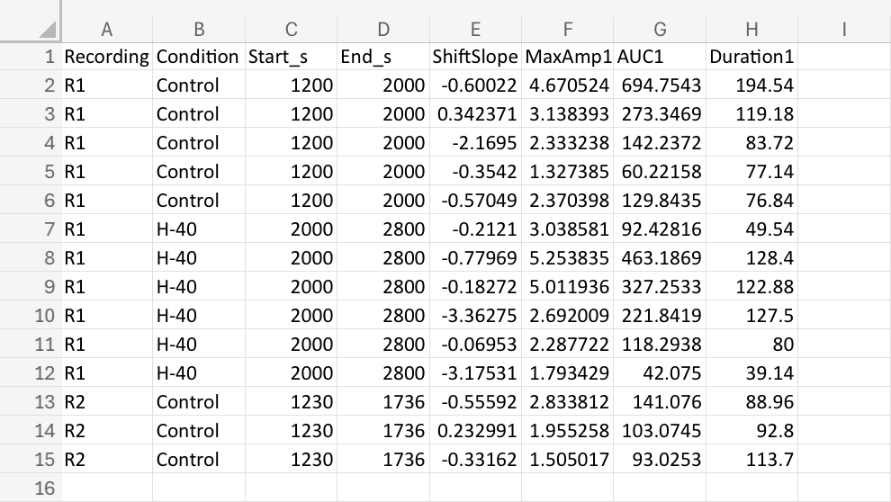

# Visualization Tools

A Python toolbox for data visualization and basic analysis of experimental datasets.

This repository is intended to grow over time as a collection of reusable plotting and analysis tools.

---

## Current Features

- Load CSV data (file picker)
- Automatically detect experimental conditions
- Group data by recording and condition
- Compute summary metrics:
  - Amplitude
  - Duration
  - Area under the curve (AUC)
  - Event rate
- Reference-based comparisons (first condition in dataset)
- Paired statistical testing (t-tests)
- Swarm plot visualizations with mean overlays

---




## Installation
```bash
pip install pandas numpy matplotlib seaborn scipy
```

## Usage
Run the script:
```bash
python csv_to_figures.py
```